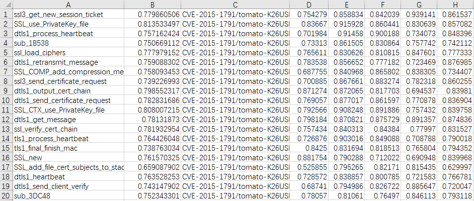

# Repository of  VulSeeker
## Introduction of VulSeeker
It's a semantic learning based vulnerability search tool for cross-platform binary. Given a vulnerability function `f`, VulSeeker can identify whether a binary program contains the same vulnerability as `f`. Currently, it support six architectures, such as X86, X64, ARM32, ARM64, MIPS32, MIPS64. If you meet any problems, please feel free to email me at gaojian094@gmail.com.

## Prerequisites
To use VulSeeker, we need the following tools installed
- IDA Pro - for generating the LSFG  and extracting features of basic blocks
- python2 - for running the vulnerability search file
- [miasm](https://github.com/cea-sec/miasm) - for converting assembly program to LLVM IR

## Usage
1. We need modify the `config.py` file. Modification is listed as following:
```
IDA32_DIR = "installation directory of 32-bit IDA Pro program"
IDA64_DIR = "installation directory of 64-bit IDA Pro program"
```
2. We put the programs to be searched in the `VulSeeker/0_Libs/search_program` directory.
3. We run the `VulSeeker/command.py` file to generate the labeled semantic flow graphs and extract initial numerical vectors for basic blocks.
4. We execute the `VulSeeker/search_by_list_vulseeker.py` file to obtain embedding vectors of the functions and get the function list in descending order of similarity scores.

## Viewing the search result
The following figure is an example of the search result.



 For each vulnerability function, there are a total of 48 compiled versions. These versions contain different architectures (X86, X64, ARM32, ARM64, MIPS32 and MIPS64), compilers (GCC v4.9 and GCC v5.5) with four optimization levels (O0-O3). 
- Column A records the function name.
- Column B is the average similarity score between the corresponding function and the vulnerability function with 48 compiled versions.
- Column C records the file to which the function belongs.
- The other items after column C are the similarity scores between a particular version of the vulnerability and the corresponding function.
